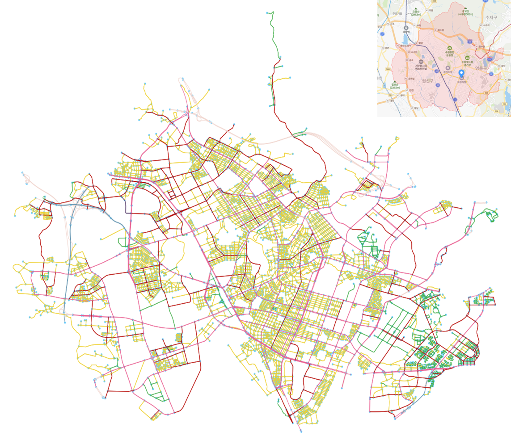

# Reproduction of Relational Fusion Network
This library contains a reproducted implementation of the Relational Fusion Network (RFN) 
introduced in the SIGSPATIAL'19 paper _Graph Convolutional Networks for Road Networks_ 
by Tobias Skovgaard Jepsen, Christian S. Jensen, and Thomas Dyhre Nielsen. 
Paper can be found in [here](https://arxiv.org/abs/1908.11567) 
and code can be found in [here](https://github.com/TobiasSkovgaardJepsen/relational-fusion-networks) .
Most of the code is from the original code.
Custom added codes are in custom folder.
Road network data for 12 Korean cities are in `data.zip`. 
First unzip it.
Pre-trained network parameter data is in `model_data` folder.
See `Train.ipynb` for training, `Test.ipynb` for testing.

You need to install osmnx, MXNet, dgl, PyTorch.
MXNet and dgl should be gpu-version.

## Example of Road Network

## Result
MSE loss for test set cities are written down in below table.

|             | Daegu    | Suwon    | Ulsan    | Yongin   | average  |
|-------------|----------|----------|----------|----------|----------|
| RFN_Int_Att | 0.01380  | 0.00647  | 0.01754  | 0.00821  | 0.01150  |
| RFN_Int_Non | 0.01725  | 0.01252  | 0.01902  | 0.02812  | 0.01923  |
| RFN_Add_Att | 0.01598  | 0.01097  | 0.01968  | 0.02828  | 0.01873  |
| RFN_Add_Non | 0.01582  | 0.01013  | 0.01954  | 0.02983  | 0.01883  |
| GAT         | 0.04189  | 0.02764  | 0.03788  | 0.05231  | 0.03993  |
| GCN         | 0.04681  | 0.03600  | 0.04592  | 0.06588  | 0.04865  |
| GraphSAGE   | 0.04487  | 0.03236  | 0.03112  | 0.04475  | 0.03827  |
| MLP         | 0.02547  | 0.01225  | 0.02236  | 0.01405  | 0.01853  |

RFN gave better result than baseline algorithms. 
Especially RFN with intentional fusion and attentional aggregation 
gave the best result.